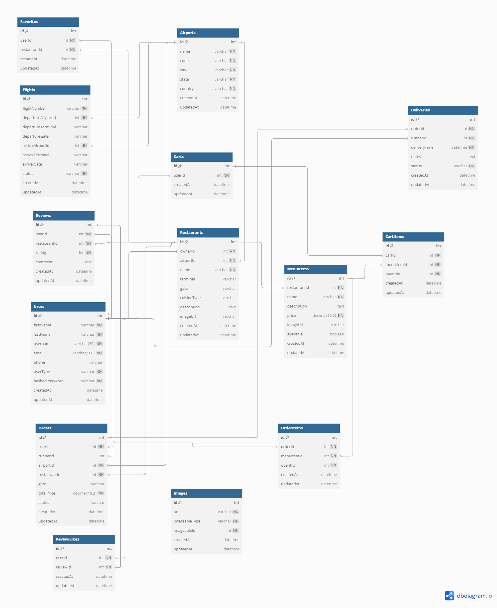

# 🍽️ DineAir

**Live Site:** [https://dineair.onrender.com](https://dineair.onrender.com)

DineAir is a full-stack restaurant ordering and management platform designed for airports. It enables travelers to discover airport restaurants, browse menus, place orders, and track deliveries. Restaurant owners and admins can manage restaurants and menus, while runners can fulfill and deliver orders.

---

## 🚀 Features

-   **User Authentication & Roles:**
    -   Secure login/signup with role-based access: Admin, Restaurant Owner, Runner, Customer.
-   **Restaurant Discovery:**
    -   Browse all airport restaurants, filter by cuisine, terminal, or gate.
-   **Menu Management:**
    -   Owners/Admins can add, edit, and delete menu items for their restaurants.
-   **Ordering System:**
    -   Customers can add menu items to their cart, checkout, and view order history.
-   **Favorites:**
    -   Users can favorite restaurants for quick access.
-   **Delivery Tracking:**
    -   Real-time order status and runner dashboard for order fulfillment.
-   **Admin Dashboard:**
    -   Manage all restaurants, users, and orders.
-   **Responsive UI:**
    -   Modern, mobile-friendly interface built with React and Vite.

---

## 🗂️ Project Structure

```
DineAir/
├── backend/
│   ├── app.js
│   ├── controllers/
│   ├── db/
│   ├── routes/
│   ├── utils/
│   └── ...
├── frontend/
│   ├── src/
│   │   ├── components/
│   │   ├── store/
│   │   ├── App.jsx
│   │   └── ...
│   ├── public/
│   └── ...
├── images/
│   └── DineAir_Schema.png
├── README.md
└── ...
```

---

## 🛠️ Tech Stack

-   **Frontend:** React 18, Redux, Vite, CSS Modules
-   **Backend:** Node.js, Express, Sequelize (PostgreSQL)
-   **Authentication:** Cookie/session-based with CSRF protection
-   **Deployment:** Render.com (frontend & backend)
-   **Testing:** Jest (unit/integration), ESLint

---

## 🗃️ Database Schema



-   **Users:** Handles authentication and roles.
-   **Restaurants:** Stores restaurant info, location, and owner.
-   **MenuItems:** Menu for each restaurant.
-   **Orders, OrderItems:** Tracks customer orders and their items.
-   **Favorites:** User-specific favorite restaurants.
-   **Runners:** Handles delivery fulfillment.

---

## 📖 API Overview

### Authentication

-   `POST /api/session` — Log in
-   `DELETE /api/session` — Log out
-   `GET /api/session` — Get current user
-   `POST /api/users` — Sign up

### Restaurants

-   `GET /api/restaurants` — List all restaurants
-   `GET /api/restaurants/:id` — Get restaurant details
-   `POST /api/restaurants` — Create restaurant (admin/owner)
-   `PUT /api/restaurants/:id` — Edit restaurant (admin/owner)
-   `DELETE /api/restaurants/:id` — Delete restaurant (admin/owner)

### Menu Items

-   `GET /api/restaurants/:restaurantId/menu-items` — List menu items
-   `POST /api/restaurants/:restaurantId/menu-items` — Add menu item (admin/owner)
-   `PUT /api/restaurants/:restaurantId/menu-items/:menuItemId` — Edit menu item (admin/owner)
-   `DELETE /api/restaurants/:restaurantId/menu-items/:menuItemId` — Delete menu item (admin/owner)

### Orders

-   `POST /api/orders` — Place order
-   `GET /api/orders/current` — Get current user's orders
-   `GET /api/orders/:orderId` — Get order details

### Favorites

-   `GET /api/favorites` — Get user's favorite restaurants
-   `POST /api/favorites/:restaurantId` — Add favorite
-   `DELETE /api/favorites/:restaurantId` — Remove favorite

### Runners

-   `GET /api/runner/orders` — Get orders to deliver
-   `PUT /api/runner/orders/:orderId` — Update order status

---

## 🧑‍💻 Local Development

### Prerequisites

-   Node.js (v18+)
-   PostgreSQL

### Setup

1. **Clone the repo:**

    ```sh
    git clone https://github.com/your-username/dineair.git
    cd dineair
    ```

2. **Install dependencies:**

    ```sh
    cd backend && npm install
    cd ../frontend && npm install
    ```

3. **Configure environment variables:**

    - Copy `.env.example` to `.env` in `/backend` and fill in your DB credentials.

4. **Set up the database:**

    ```sh
    cd backend
    npx sequelize db:create
    npx sequelize db:migrate
    npx sequelize db:seed:all
    ```

5. **Run the backend:**

    ```sh
    npm start
    ```

6. **Run the frontend:**

    ```sh
    cd ../frontend
    npm run dev
    ```

7. **Visit:**
   [http://localhost:5173](http://localhost:5173)

---

## 🧩 Notable Code Highlights

-   **Role-based UI rendering:**
    Components and routes are protected and rendered based on user role.
-   **Idempotent seeders:**
    Demo data is only inserted if not already present, so deletions persist.
-   **Soft delete pattern:**
    (If implemented) for menu items/restaurants to avoid accidental data loss.
-   **Modular Redux store:**
    Each feature (auth, restaurants, menu, cart, etc.) has its own slice.

---

## ✨ Future Enhancements

-   Real-time order updates with WebSockets
-   Payment integration (Stripe/PayPal)
-   Push notifications for order status
-   Enhanced analytics dashboard for admins/owners

---

## 🤝 Contributing

1. Fork the repo
2. Create your feature branch (`git checkout -b feature/YourFeature`)
3. Commit your changes (`git commit -m 'Add some feature'`)
4. Push to the branch (`git push origin feature/YourFeature`)
5. Open a Pull Request

---

## 📫 Contact

For questions or feedback, please open an issue or contact [your-email@example.com](mailto:your-email@example.com).

---

**DineAir — Elevate your airport dining experience!**
