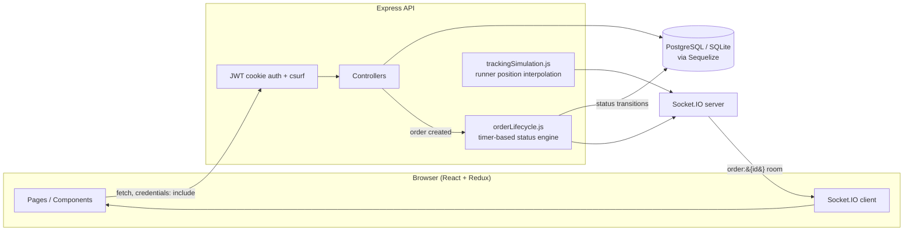

# DineAir

**Airport food delivery, DoorDash-style.** Travelers browse restaurants at their terminal, build a cart, check out with a **gate** as the delivery address, and watch a runner move toward them on a live map — all backed by a real server-owned order lifecycle, not a client-side illusion.

**Live demo:** [dineair.onrender.com](https://dineair.onrender.com) *(cold-starts on Render's free tier — first load can take ~30s)*

---

## Why this project

Most portfolio CRUD apps stop at "list, create, edit, delete." DineAir also has to answer the harder question every marketplace app runs into: **who owns the truth about an order's state, and what happens when the client isn't watching?**

The order/delivery pipeline here is server-driven: placing an order kicks off a timer-based lifecycle on the backend (`backend/utils/orderLifecycle.js`) that assigns a runner round-robin, advances the order through `pending → preparing → picked_up → on_the_way → delivered`, and persists every transition — independent of whether a browser tab is open. A client that reconnects mid-delivery (or a server that restarts) reconstructs status from elapsed wall-clock time rather than trusting local state. Socket.IO pushes updates to clients that *are* connected, scoped per-order (`io.to(`order:${orderId}`)`) rather than broadcast globally.

That single decision — real backend state ownership instead of a `setTimeout` in the browser — is the throughline for most of the engineering in this repo: authorization checks that assume any client input is hostile, room-scoped realtime events, and a design system built to make all of it legible (status chips, a live "departures board," gate-aware checkout).

---

## Highlights

- **Server-owned order lifecycle** — runner assignment, status progression, and delivery completion all live in the backend and survive reconnects/restarts (`backend/utils/orderLifecycle.js`).
- **Role-based app** — customer, restaurant owner, admin, and runner each get tailored navigation and route-level guards (`frontend/src/components/ProtectedRoute.jsx`), backed by matching authorization checks on every mutating endpoint.
- **Real-time tracking** — Socket.IO rooms scoped per order; a runner's live location updates the customer's map without a refresh.
- **"Premium airport" design system** — a deep slate/navy + amber palette, a departure-board mono typeface for statuses and gate codes, dark-first with a persisted light/dark toggle.
- **Curated, content-verified imagery** — every restaurant/menu photo is sourced and visually checked (not just HTTP-200-checked) rather than trusting a memorized stock-photo ID.
- **Full-stack auth** — JWT in an httpOnly cookie, CSRF tokens on every mutating request, bcrypt password hashing, ownership/role checks on every controller that touches another user's data.

---

## Tech stack

| Layer | Technologies |
|---|---|
| Frontend | React 18, Vite 5, React Router 6, Redux + Thunk, Tailwind CSS, Framer Motion, Socket.IO client |
| Backend | Node.js, Express, Sequelize (SQLite dev / PostgreSQL prod), bcrypt, JWT (httpOnly cookie), csurf, Socket.IO, Helmet (CSP) |
| Testing | Vitest + React Testing Library (frontend), Jest + Supertest (backend, in-memory SQLite) |
| Maps | Google Maps JavaScript API (legacy `Marker` + `DirectionsService`/`DirectionsRenderer`) |
| CI/Deploy | GitHub Actions, Render (static frontend + web service backend) |

---

## Architecture


```mermaid
flowchart LR
    subgraph Client["Browser (React + Redux)"]
        UI[Pages / Components]
        Sock[Socket.IO client]
    end

    subgraph API["Express API"]
        Auth[JWT cookie auth + csurf]
        Ctrl[Controllers]
        Life[orderLifecycle.js<br/>timer-based status engine]
        Track[trackingSimulation.js<br/>runner position interpolation]
    end

    DB[(PostgreSQL / SQLite<br/>via Sequelize)]
    IO[Socket.IO server]

    UI -->|fetch, credentials: include| Auth
    Auth --> Ctrl
    Ctrl --> DB
    Ctrl -->|order created| Life
    Life -->|status transitions| DB
    Life --> IO
    Track --> IO
    IO -->|order:&#123;id&#125; room| Sock
    Sock --> UI
```

- **Frontend entry:** `frontend/src/main.jsx` → `ThemeProvider` → Redux `Provider` → `App` (router + toast host).
- **State:** `frontend/src/store/` — session, favorites, search, reviews.
- **Shared UI:** `frontend/src/components/ui/` — cards, `StatusChip`, `SmartImage` (shimmer + branded fallback), empty states, skeletons.
- **API helper:** `frontend/src/utils/apiFetch.js` — single fetch wrapper that attaches the CSRF header and `credentials: "include"` on every mutating request.
- **Order lifecycle:** `backend/utils/orderLifecycle.js` (status/runner timeline) + `backend/utils/trackingSimulation.js` (map position interpolation) — see [Why this project](#why-this-project).

---

## Features

- **Auth** — signup, login, logout, session restore; one-click demo login per role.
- **Discovery** — restaurant listing and search, real aggregate ratings (computed from actual review rows, not fabricated), favorites.
- **Ordering** — menu browsing, cart, gate-aware checkout, order history, reorder.
- **Delivery tracking** — live map, runner ETA, status timeline, gate-change handling.
- **Owner tools** — CRUD restaurants and menu items, scoped to restaurants you own.
- **Admin tools** — manage every restaurant across the platform.
- **Runner tools** — assigned-delivery queue, live location broadcast, manual status/complete actions.
- **Account** — profile edit, account deletion (self or admin).

---

## Testing

```bash
cd frontend && npm test   # Vitest + React Testing Library — 28 tests
cd backend && npm test    # Jest + Supertest against an in-memory SQLite DB — 17 tests
```

Backend tests spin up the real Express app (`backend/app.js`) against a fresh in-memory SQLite database per test file and drive it through Supertest with a real CSRF handshake — no mocked HTTP layer. Coverage includes: signup/login/session-restore, computed rating aggregation, menu-item authorization (customer/wrong-owner/owner/admin), the order → runner-assignment → Delivery pipeline, favorites round-trip, and user-delete authorization.

Frontend tests cover the pure logic (cart totals, rating formatting, walking-ETA estimation), component behavior (`SmartImage`'s load/error states, `StatusChip`'s status-to-label mapping), and route protection (`RequireAuth`/`RequireRole` redirect behavior) with a real Redux store and `MemoryRouter` rather than mocking React Router.

CI (`.github/workflows/ci.yml`) runs both suites — plus lint, a frontend production build, and a backend migration smoke-test — on every push/PR to `main`.

---

## Run locally

### Prerequisites

- Node.js 18+
- PostgreSQL (optional for local dev — SQLite is the default)

### Backend

```bash
cd backend
npm install
# Copy .env.example → .env and set JWT_SECRET at minimum
npx sequelize-cli db:migrate
npx sequelize-cli db:seed:all
npm start
# API: http://localhost:8000
```

### Frontend

```bash
cd frontend
npm install
npm run dev
# App: http://localhost:5174 — Vite proxies /api to http://localhost:8000
```

### Google Maps (optional but recommended)

1. Copy `frontend/.env.example` → `frontend/.env` and set `VITE_GOOGLE_MAPS_API_KEY`.
2. In [Google Cloud Console](https://console.cloud.google.com/) → APIs & Services → Credentials, restrict the key to your dev/prod origins and enable **Maps JavaScript API** + **Directions API** (the runner→gate route line needs Directions).
3. Restart `npm run dev` after any `.env` change. Without a key, the map renders a CI-safe setup message instead of failing.

The map uses the legacy `google.maps.Marker` API rather than `AdvancedMarkerElement`/Map IDs — a deliberate tradeoff to avoid requiring a configured Map ID for a demo project, at the cost of Google's older (still supported, but deprecated-path) marker API. Migrating to `AdvancedMarkerElement` is the clearest remaining upgrade if this were headed to production.

---

## Deploying (Render)

Two services: a **static site** for the frontend and a **web service** for the backend.

**Backend (web service):**
- Build command: `npm run render-build` (repo root) — builds the frontend, builds the backend, and runs `db:migrate`. It deliberately does **not** run seeders on every deploy (seeders aren't idempotent against existing data).
- Start command: `npm start --prefix backend`
- Environment: `NODE_ENV=production`, `DATABASE_URL` (Render Postgres), `JWT_SECRET`, `JWT_EXPIRES_IN`, `FRONTEND_URLS` (comma-separated allowed origins), `GOOGLE_MAPS_API_KEY` (server-side Directions calls).
- First deploy only: seed demo data once via Render's shell — `npm run db:deploy --prefix backend`. The seeders reference hardcoded row IDs and assume a pristine database, so this isn't safe to repeat against a database that already has rows in it (see `backend/.env.example` for the full explanation and reset procedure).

**Frontend (static site):**
- Build command: `npm ci && npm run build`
- Publish directory: `dist`
- Environment: `VITE_GOOGLE_MAPS_API_KEY` — this is a **build-time** variable (Vite inlines it), so it must be set before the build runs, not just at runtime.

If the two services live on different Render domains, also set `TOKEN_COOKIE_SAMESITE=none` on the backend so the auth cookie survives cross-site credentialed requests (requires HTTPS, which Render provides by default).

---

## Demo accounts

After seeding, use **Demo login** on the sign-in page, or:

| Role | Email | Password |
|---|---|---|
| Customer | `JustinTyme@dineair.com` | `password` |
| Admin | `admin@dineair.com` | `adminpassword` |
| Restaurant owner | `owner1@dineair.com` | `ownerpassword` |
| Runner | `carrie.on@dineair.com` | `password4` |

---

## Screenshots

_Add 3–5 images here for GitHub/portfolio (hero, restaurant grid, cart/checkout, tracking map, mobile nav)._

```text
docs/screenshots/
  landing.png
  restaurants.png
  checkout-gate.png
  tracking.png
```

---

## Notable technical decisions

- **csurf over a header-only double-submit scheme:** `csurf` is in maintenance mode upstream, but it's a well-understood, battle-tested implementation of the double-submit cookie pattern, and swapping it for a hand-rolled equivalent would trade a known, audited quantity for an unaudited one with no functional upside for a demo-scale app. If this were a high-traffic production service, the honest next step would be re-evaluating against `csrf-csrf` or an origin-check-based approach instead of cookie tokens entirely.
- **Legacy Google Maps markers over `AdvancedMarkerElement`:** see [Google Maps](#google-maps-optional-but-recommended) above — avoids a required Map ID for a project meant to run with zero paid configuration.
- **Server-owned order lifecycle over client timers:** see [Why this project](#why-this-project) — the previous implementation tracked delivery progress in `sessionStorage` on the client, which meant "progress" reset on refresh and had no relationship to what actually happened server-side. The current implementation makes the backend the single source of truth and the client a (re-attachable) viewer of it.
- **SQLite for dev/test, PostgreSQL for prod:** keeps local setup and CI to zero external services while still exercising the real Sequelize/Postgres-shaped schema (migrations run against both).

---

## API notes

Authentication lives under **`/api/auth`** (not `/api/session`):

- `POST /api/auth/signup`, `POST /api/auth/login`, `DELETE /api/auth/logout`, `GET /api/auth/session`

Other resources: `/api/restaurants`, `/api/restaurants/:id/menu-items`, `/api/carts/items`, `/api/orders`, `/api/deliveries`, `/api/favorites`, `/api/users/:id`. See `backend/routes/api/` for the full set.

---

## Database schema


---

## Contributing

Fork → feature branch → PR. Keep changes focused; match existing Tailwind patterns (`da-card`, `da-input`, `da-btn-primary`) and run both test suites before opening a PR.

---

## License / contact

Portfolio project. Replace this section with your license and contact info as needed.

**DineAir** — skip the line; eat at your gate.
