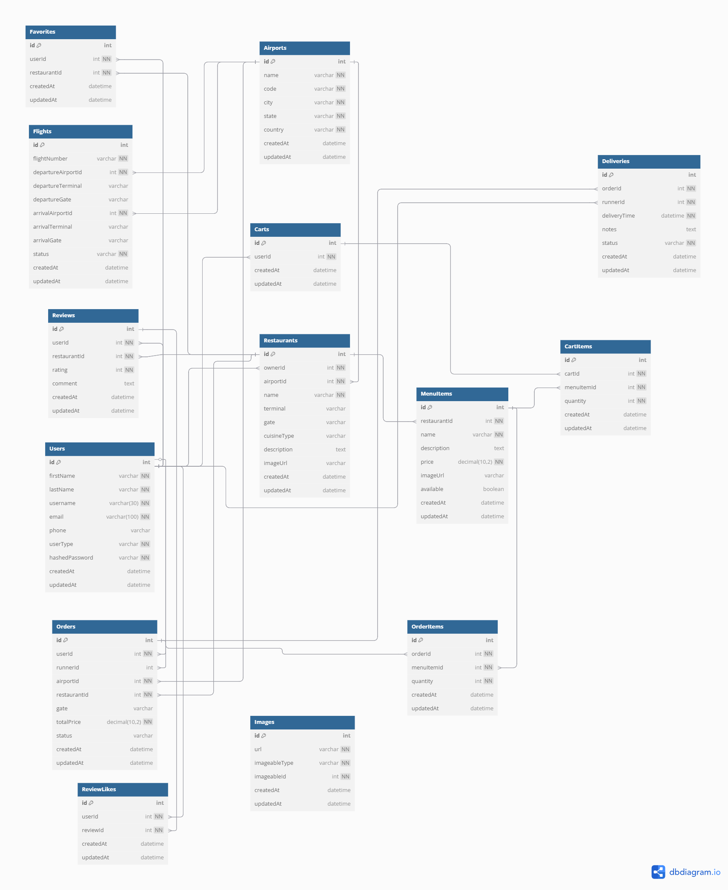

# DineAir

**Concept:** DoorDash-style ordering for airports—travelers browse terminal restaurants, build a cart, check out with a **gate delivery** address, and track the runner on a map.

**Live demo:** [dineair.onrender.com](https://dineair.onrender.com) *(if deployed)*

---

## Highlights (portfolio)

- **Role-based app:** customer, restaurant owner, admin, and runner flows share one UI with tailored navigation.
- **Gate-centric checkout:** orders store gate + coordinates for maps and ETA-style UX.
- **Real-time touches:** Socket.io for gate changes and order status (where wired in the demo).
- **Polished UI:** React + **Tailwind CSS** design system (spacing, typography, cards, dark mode), Framer Motion on key screens, skeleton loaders and empty states.
- **Full-stack:** Express + Sequelize + PostgreSQL API with JWT **httpOnly cookies**, CSRF for mutating requests, and Redux on the client.

---

## Tech stack

| Layer | Technologies |
|--------|----------------|
| Frontend | React 18, Vite, React Router 6, Redux + Thunk, Tailwind CSS, Framer Motion, React Toastify, Socket.io client |
| Backend | Node.js, Express, Sequelize, PostgreSQL, bcrypt, JWT (cookie), CSRF |
| Maps | Google Maps JavaScript API (tracking / directions) |

---

## Architecture (high level)

```
Browser (Vite dev server proxies /api → Express)
    ↓
Express API (/api/*)
    ├── auth (cookie JWT, CSRF)
    ├── restaurants, menu items, carts, orders
    ├── reviews + likes
    ├── deliveries / runner
    └── admin + owner routes
    ↓
PostgreSQL (Sequelize models & migrations)
```

- **Frontend entry:** `frontend/src/main.jsx` → `ThemeProvider` → Redux `Provider` → `App` (router + toast host).
- **State:** `frontend/src/store/` — session, favorites, search, reviews, etc.
- **Shared UI:** `frontend/src/components/ui/` (cards, empty states, skeletons, gate selector).
- **API helper:** `frontend/src/utils/apiFetch.js` — `credentials: "include"` for cookie auth.

---

## Features

- Auth: signup, login, logout; demo logins by role.
- Restaurant discovery: listing, search (navbar), filters, favorites.
- Menu: restaurant detail + menu item detail; add to cart (auth required).
- Cart & checkout: summary, estimated fees, gate selector, place order.
- Delivery tracking: order steps, map, gate badge, flight sidebar (demo data).
- Owner: CRUD restaurants, manage menu items on `.../menu-items` route.
- Admin: manage all restaurants.
- Runner: assigned deliveries list + map + geolocation emit.
- Account: profile edit, account deletion.
- Reviews: list, create (logged in), edit/delete own, likes.

---

## Run locally

### Prerequisites

- Node.js 18+
- PostgreSQL

### Backend

```bash
cd backend
npm install
# Copy .env.example → .env and set DATABASE_URL or DB credentials + secrets
npx sequelize-cli db:create
npx sequelize-cli db:migrate
npx sequelize-cli db:seed:all
npm start
# Default API: http://localhost:8000
```

### Frontend

```bash
cd frontend
npm install
npm run dev
# App: http://localhost:5174 (see vite.config.js for port)
```

The Vite dev server proxies `/api` to `http://localhost:8000`.

### Google Maps

1. Copy `frontend/.env.example` → `frontend/.env` (the real file must be named `.env`; `.env.example` alone is not loaded by Vite).
2. Create a browser key and set `VITE_GOOGLE_MAPS_API_KEY` in `frontend/.env`. Restart `npm run dev` after changes.
3. Run the dev server from the `frontend` folder (`cd frontend && npm run dev`). `vite.config.js` sets `root` and `envDir` to the `frontend` directory so `.env` is always read from there even if the working directory differs.
4. In development, the browser console prints `[DineAir][Vite env]` with all exposed env keys (values masked for `VITE_*` and other sensitive names). If `VITE_GOOGLE_MAPS_API_KEY` is empty, that log will say so.
5. In [Google Cloud Console](https://console.cloud.google.com/) → APIs & Services → **Credentials**, restrict the key:
   - **Application:** HTTP referrers (e.g. `http://localhost:5174/*`, your production URL).
   - **APIs:** enable at least **Maps JavaScript API** and **Directions API**. The map uses `DirectionsService` / `DirectionsRenderer` for the runner→gate line; without **Directions API**, routes may fail or the key may be rejected for those calls.

The script loads from `loadGoogleMaps.js` (not `index.html`). If the key is missing, the UI shows a setup message (CI-safe).

**Libraries loaded:** `geometry` and `places` are appended to the script URL; only map, markers, and directions are used in `Map.jsx` today (the extra libraries are optional load).

### CI

GitHub Actions (`.github/workflows/ci.yml`) runs frontend **lint + build** (with an empty Maps key so CI passes) and **backend `npm ci`** on push/PR to `main`/`master`.

---

## Demo accounts

After seeding, you can use **Demo login** on the sign-in page or enter:

| Role | Email | Password |
|------|--------|----------|
| Customer | `JustinTyme@dineair.com` | `password` |
| Admin | `admin@dineair.com` | `adminpassword` |
| Restaurant owner | `owner1@dineair.com` | `ownerpassword` |
| Runner | `carrie.on@dineair.com` | `password4` |

*(Exact users depend on seeders—adjust if your seeds differ.)*

---

## Screenshots

_Add 3–5 images here for GitHub / portfolio (hero, restaurant grid, cart/checkout, tracking map, mobile nav)._

```text
docs/screenshots/
  landing.png
  restaurants.png
  checkout-gate.png
  tracking.png
```

---

## API notes (correct paths)

Authentication lives under **`/api/auth`** (not `/api/session`):

- `POST /api/auth/login`, `POST /api/auth/signup`, `DELETE /api/auth/logout`
- `GET /api/auth/session` — current user

Other routes include `/api/restaurants`, `/api/carts/items`, `/api/orders`, `/api/deliveries`, etc. See `backend/routes/api/` for the full set.

---

## Database schema



---

## Scripts (repo root)

| Script | Purpose |
|--------|---------|
| `npm run dev:backend` | Start backend (per root `package.json`) |
| `cd frontend && npm run dev` | Vite dev |
| `cd frontend && npm run build` | Production build |
| `npm run sequelize-cli -- db:migrate` | Migrations via root helper |

---

## Contributing

Fork → feature branch → PR. Keep changes focused; match existing Tailwind patterns (`da-card`, `da-input`, `da-btn-primary`).

---

## License / contact

Capstone / portfolio project. Replace this section with your license and contact as needed.

**DineAir** — skip the line; eat at your gate.
